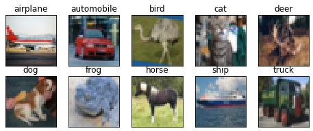

First step is to get Keras installed!

>[action]
> Run the following command to install Keras
>
```bash
$ sudo conda install -c conda-forge keras
```

If you get a `conda: command not found` error, make sure to run the following in your terminal: `export PATH=~/anaconda3/bin:$PATH` and then try running the command again.

If the above command hangs on the install, try running `sudo conda install -c conda-forge/label/cf201901 keras` instead.

**WARNING:** There are known difficulties in getting Keras to install properly. Please refer to your instructor and/or TAs if you run into trouble.

# Importing our Modules

The first thing we need to do is to import all of the necessary modules from Keras, as well as our plotting tools( for visualizing whats going on under the hood)

>[action]
> Create a new Jupyter notebook and paste the following into it:
>
```python
# Import all modules
import time
import matplotlib.pyplot as plt
import numpy as np
from keras.models import Sequential
from keras.layers import Dense
from keras.layers import Dropout
from keras.layers import Flatten
from keras.constraints import maxnorm
from keras.optimizers import SGD
from keras.layers import Activation
from keras.layers.normalization import BatchNormalization
from keras.layers.convolutional import Conv2D
from keras.layers.convolutional import MaxPooling2D
from keras.utils import np_utils
from sklearn.metrics import accuracy_score
from keras import backend as K
if K.backend()=='tensorflow':
    K.set_image_dim_ordering("th")
>
# Import Tensorflow with multiprocessing
import tensorflow as tf
# import multiprocessing as mp
>
# Loading the CIFAR-10 datasets
from keras.datasets import cifar10
>
# fix random seed for reproducibility
np.random.seed(1010)
```

Next, we need to load the training data as well as the test data into variables we can use in our model. This follows the same format as you're familiar with!

>[action]
> Add the following to your notebook:
>
```python
(x_train, y_train), (x_test, y_test) = cifar10.load_data()
```

Now we need to make a custom function that you can use in your future projects to visualize classes (or categories) that your images belong to. This will depend on the `class_name` list that we'll define now:

>[action]
> Add the following to your notebook:
>
```python
# Here are the classes in the dataset. We'll be using this to
class_names = ['airplane','automobile','bird','cat','deer',
               'dog','frog','horse','ship','truck']
>
num_classes = 10 #number of cifar-10 data set classes
>
def visualize_classes():
    fig = plt.figure(figsize=(8,3))
    for i in range(num_classes):
        ax = fig.add_subplot(2, 5, 1 + i, xticks=[], yticks=[])
        idx = np.where(y_train[:]==i)[0]
        features_idx = x_train[idx,::]
        img_num = np.random.randint(features_idx.shape[0])
        im = np.transpose(features_idx[img_num,::],(1,2,0))
        ax.set_title(class_names[i])
        plt.imshow(im)
    plt.show()
>    
visualize_classes()
```

Your output should be the following:


# Preprocessing and Normalization

A special note in working with data and neural networks is that some preprocessing is involved.

For image processing, the **images must have the same dimensions and should have near the same pixel density** to really make the most out of your predictions. In your own projects, this might mean that you must scale or crop your images beforehand in preprocessing. Luckily for us, the `Cifar-10` dataset comes preprocessed.

**Image data normalization** is an important step which ensures that each input parameter (pixel, in this case) has a similar data distribution. This makes convergence faster while training the network. For image inputs we might choose to scale the normalized data in the range `[0,1]` or `[0, 255]`.

Pixel values are in the range of `0 to 255` for each of the `red`, `green` and `blue` channels. (If you've ever worked with RGB colors on web or mobile, this is where the values come from)

Since we know the range of the input values due to them following the range of RBG values, we can easily normalize our pixel data to a range `0 to 1` by dividing each value by the maximum observation which is `255` (the end of the RBG color spectrum).

The data is loaded as integers, so we must cast it to floating point values in order to perform the division.

>[action]
> Add the following to your notebook:
>
```python
x_train = x_train.astype('float32')
x_test = x_test.astype('float32')
x_train  /= 255
x_test /= 255
```

Now each image has been converted into a 3x3 matrix representation of each of the color values of the RBG spectrum! Let's have a look at the first picture in numerical format to check:

>[action]
> Copy `x_train[0]` into your notebook, run it, and see if the output matches the following:
>
```
array([[[ 0.23137255,  0.16862746,  0.19607843, ...,  0.61960787,
          0.59607846,  0.58039218],
        [ 0.0627451 ,  0.        ,  0.07058824, ...,  0.48235294,
          0.46666667,  0.47843137],
        [ 0.09803922,  0.0627451 ,  0.19215687, ...,  0.4627451 ,
          0.47058824,  0.42745098],
        ...,
        [ 0.81568629,  0.78823531,  0.7764706 , ...,  0.627451  ,
          0.21960784,  0.20784314],
        [ 0.70588237,  0.67843139,  0.72941178, ...,  0.72156864,
          0.38039216,  0.32549021],
        [ 0.69411767,  0.65882355,  0.7019608 , ...,  0.84705883,
          0.59215689,  0.48235294]],
>
       [[ 0.24313726,  0.18039216,  0.1882353 , ...,  0.51764709,
          0.49019608,  0.48627451],
        [ 0.07843138,  0.        ,  0.03137255, ...,  0.34509805,
          0.32549021,  0.34117648],
        [ 0.09411765,  0.02745098,  0.10588235, ...,  0.32941177,
          0.32941177,  0.28627452],
        ...,
        [ 0.66666669,  0.60000002,  0.63137257, ...,  0.52156866,
          0.12156863,  0.13333334],
        [ 0.54509807,  0.48235294,  0.56470591, ...,  0.58039218,
          0.24313726,  0.20784314],
        [ 0.56470591,  0.50588238,  0.55686277, ...,  0.72156864,
          0.4627451 ,  0.36078432]],
>
       [[ 0.24705882,  0.17647059,  0.16862746, ...,  0.42352942,
          0.40000001,  0.40392157],
        [ 0.07843138,  0.        ,  0.        , ...,  0.21568628,
          0.19607843,  0.22352941],
        [ 0.08235294,  0.        ,  0.03137255, ...,  0.19607843,
          0.19607843,  0.16470589],
        ...,
        [ 0.3764706 ,  0.13333334,  0.10196079, ...,  0.27450982,
          0.02745098,  0.07843138],
        [ 0.3764706 ,  0.16470589,  0.11764706, ...,  0.36862746,
          0.13333334,  0.13333334],
        [ 0.45490196,  0.36862746,  0.34117648, ...,  0.54901963,
          0.32941177,  0.28235295]]], dtype=float32)
```

# Encoding our Output Label

The output variables are one-hot encoded as a vector of integers from `0 to 1` for each class. This transforms the output into into a binary matrix in order to best model the classification problem of sorting images into 10 "buckets". We know there are 10 classes for this problem, so we can expect the binary matrix to have a width of 10.

>[action]
> Add the folowing to your notebook:
>
```python
y_train = np_utils.to_categorical(y_train, num_classes)
y_test = np_utils.to_categorical(y_test, num_classes)
```
