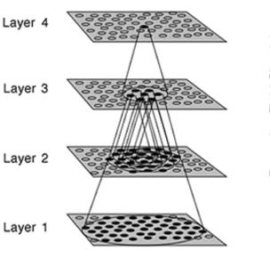

## Biological mimicry in image recognition

You may ask yourself, what's the big deal about using a convolutional neural networks for image recognition? Well that comes down to how it mimics pattern recognition in the visual cortex! The **visual cortex** is a part of your brain that is the powerhouse of sight, vision, and object recognition. Many neurons in the visual cortex have a **small local receptive field**, meaning they react only to visual stimuli located in a limited region of the visual field.

The receptive fields of different neurons may overlap, and together they tile the entire visual field. Some of those neurons only fire on images of vertical lines, while others only fire to lines with different orientations (two neurons may have the same receptive field but fire on different line orientations and directions). Some neurons have larger receptive fields, and they fire on more complex patterns that are combinations of the patterns the lower levels have detected.

Below is a visual example of what this looks like.

# Layered Neurons

The most important building block of a CNN is the convolutional layer. Neurons in the first convolutional layer are not connected to every single pixel in the input image, but only to pixels in their receptive fields. In turn, each neuron in the second convolutional layer is connected only to neurons located within a small rectangle in the first layer.

This architecture allows the network to concentrate on low-level features in the first hidden layer, then assemble them into higher-level features in the next hidden layer, and so on. This structure is very common in real-world images, and is one of the reasons why convolutional neural networks work so well for image recognition.

>[action]
> What does this system allow us to recognize in our images?

<!-- -->

>[solution]
> This is the same system that allows us to recognize **patterns**, and what is an image other than patterns that converge to make a consolidated image that your brain recognize as an item? 😄

Let's put this idea into action!
