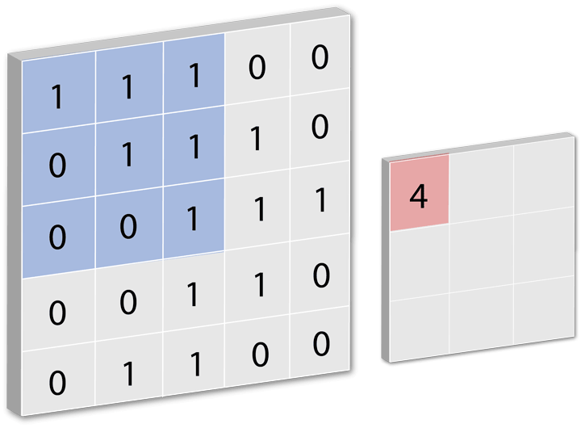
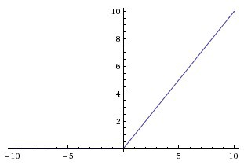
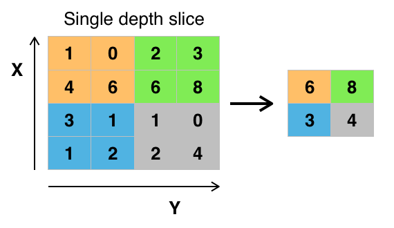
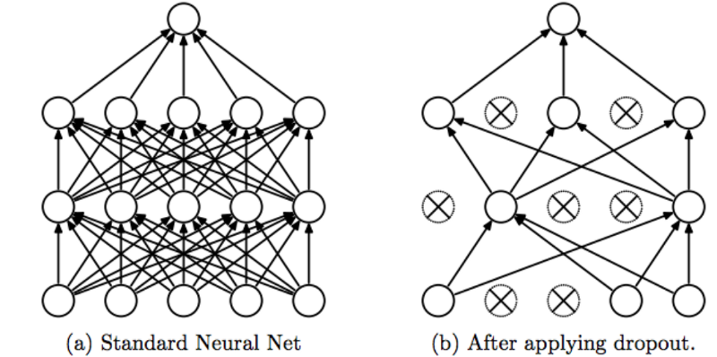

Were going to be be building a sequential model classify our images and the architecture is as follows:

1. Convolutional input layer, 32 feature maps with a size of 3×3, a rectifier activation function
1. Convolutional input layer, 32 feature maps with a size of 3×3, a rectifier activation function
1. Max Pool layer with size 2×2
1. Dropout set to 25%
1. Convolutional input layer, 64 feature maps with a size of 3×3, a rectifier activation function
1. Convolutional input layer, 64 feature maps with a size of 3×3, a rectifier activation function
1. Max Pool layer with size 2×2
1. Dropout set to 25%
1. Flatten layer
1. Fully connected layer with 512 units and a rectifier activation function
1. Dropout set to 50%
1. Fully connected output layer with 10 units and a softmax activation function

This is a lot to take in if you aren't familiar with the structure of CNN's so lets walk through the parts one by one!

# The Convolutional Layer

A **convolution layer** tries to extract higher-level features by replacing data for each (one) pixel with a value computed from the pixels covered by the filter centered on that pixel (all the pixels in that region).

In the GIF below (cred: Fletcher Bach), the filter used is a 3x3 matrix that counts all of the occurrences of 1 (representing that a color is present) in the binary matrix and maps them onto a smaller feature space for the next layer:

The function that Keras uses for this is [Conv2D](https://keras.io/layers/convolutional/#conv2d) and it has the following parameters:

- The first argument is the _number of filters_, in this case `32`. Filters are like feature detectors and can represent the number of features (like edges, lines, object parts etc...) that the network can potentially learn. Also note that each filter generates a feature map. **Feature maps** allow you to learn the explanatory factors within the image so the more of them present, the more the network learns.
- The next tuple sets the `kernel_size` which represents the filter we discussed earlier, which we've defined as a 3x3 matrix. Of note in this tutorial is that we did not set the **strides**. This is how many spaces that the kernel slides for each of its movements, this is shown by how the filter slides in the GIF above.
- The **input shape** denotes the shape of the input that we'll be passing into the network. The `3` represents the RBG color arrays that we previously split each image into. The `32`'s that you see are a representation of the size of the images, which coincidentally are 32 by 32. Since all of the photos have been normalized at this point this should not be an issue in processing, but it is something that you should be aware of in your own implementations

Please refer to the above Conv2D documentation if you want to learn more about the other potential arguments available.

# The Activation Function

Your activation functions are at the core of what makes your neurons work and controls the threshold they will fire at. You'll cover more of this in later lessons, but just know that the activation functions are customizable to your CNN stack and experimenting with different functions such as `tahn` and `sigmoid` will yield different results depending on your data and model.

For reference, the `ReLu` activation function's threshold can be visualized as the following:

# The MaxPooling Layer

This is all about the convolved feature vs pooled feature, what does this mean? Lets take a look at a visual example:

It means **replacing the highest value in an output matrix with the local maximum value of that array.** The above graphic (as well as ours) uses a 2x2 max pooling. This takes the maximum of the matrix and condenses it in the next layer to a smaller feature space that's represented by that local maximum

**Note:** this is non overlapping thus reducing the resolution, and therefore the amount of processing on the next layer is reduced. This assists in optimization.

# The Dropout Layer

**Dropout** is a technique where randomly selected neurons are ignored during model training. They are “dropped-out” or removed at random. This means that their contribution to the activation of downstream neurons is removed on the forward pass and any weight updates are not applied to the neuron on the backward pass. The purpose of this is to prevent "over-fitting”. A fully connected layer occupies most of the parameters, therefore neurons develop co-dependency amongst each other during training. This curbs the individual power of each neuron, leading to over-fitting of training data.

Essentially, this keeps the network from raw memorizing the training data and keeps it actually learning.

Here is a representation of how dropout works vs a fully connected layer:

# The Flatten and Dense Layers

The last stage of a CNN is a classifier. It is called a **dense layer**, which is just an neural network classifier and is fully connected.

Because a neural network classifier needs individual features – just like any other classifier – this means it needs a feature vector.

Therefore, you need to convert the output of the convolutional part of the CNN into a 1D feature vector, to be used by the neural network part of it. This operation is called **flattening.** It gets the output of the convolutional layers and flattens all of its structure to create a single long feature vector to be used by the dense layer for the final classification.

This is then fed to the actual classifier which is referred as softmax.

# Softmax

**Softmax classifiers** give you probabilities for each class label based on what the network has learned. The function itself takes an N-dimensional array (in this case since its flattened, it will be a 1D array). _Softmax is ultimately what gives you access to how sure the network is that a certain image (in our case) belongs to a certain category._

With all of these in mind lets look at a wide overview of the entire network!
